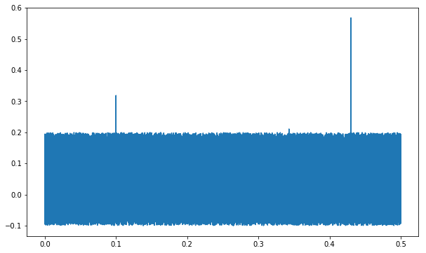
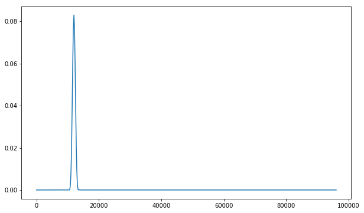
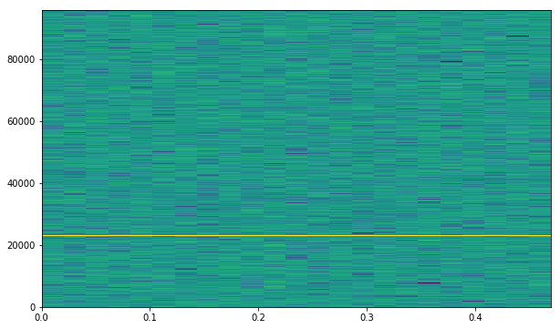

===========
Quick start
===========

First, let's generate an audio signal ``x(t)``.  The signal is a sine wave at 23kHz, with some noise and impulses.

.. code-block:: python

   import numpy as np

   sr = 192000
   N = int( 0.5 * sr) # 0.5 second of audio
   t = np.arange(N) / sr

   # some sines
   x = .1*np.sin( 2*np.pi * 23000. * t) # sinwave f = 23kHz

   # add some noise
   x += np.random.rand(N) * 0.1

   #some impulses
   x[int(0.1   * sr)] += 0.3
   x[int(0.343 * sr)] += 0.2
   x[int(0.43  * sr)] += 0.5

   plt.plot(t, x)
   plt.show()

We split the audio signal into blocks of 4096 samples (in practise, unless we need to process very small audio files or
short signals, the signal will always be formatted in blocks of a given sample size).

.. code-block:: python

   n = 4096  # block size
   # reshape
   blocks = x[: -(x.size % n) or None].reshape(-1, n)
   blocks.shape
   # (23, 4096)

To compute the audio features, we import and use the ``FeaturesComputer`` class.

The constructor takes the following input parameters:

* ``n``: the size of the audio blocks that are going to be processed.
* ``rate``: the audio sample rate.
* ``nfft``: the size of block that are going to be used to compute the FFT. If ``nfft < n``, the blocks will be truncated, if ``nfft > n``, the blocks will be zero-padded.
* ``window``: the window to be applied before computing the FFT.
* ``features``: the features to be computed. If None, all registered features are be computed. If specified, this must be a list of strings with values matching registered features (check ``FeaturesComputer.EXPORT`` for the list of available features).

The audio blocks are processed using the ``compute()`` method.
The latter takes a numpy array of size ``(m, n)``, with ``m`` the number of blocks and ``n`` the block size.
It returns a dictionary of audio features. For each feature, the value is an array of size ``m`` (for 1D features), of size ``(m, :)`` for 2d features, etc.

.. code-block:: python

   from wavely.signal.features import FeaturesComputer

   af = FeaturesComputer(n=n, rate=sr, nfft=n, window=np.hanning)
   feats = af.compute(blocks)
   feats

.. code-block:: text

   {
      'audiblelevel': array([68.26280688, 68.12773941, ...]),
      'intensitylevel': array([73.13797761, 73.13005029, ...]),
      'bandleq': array([[47.73718357, 30.18691134, ...],
                        [47.73718357, 30.18691134, ...],
                        ...]),
      ...
   }

Some intermediate values are computed but not exported (see :ref:`features-label`).

All the values computed by the object can be retrieved using ``af[name]``, for example to plot the spectrum corresponding to the first audio block:

.. code-block:: python

    import matplotlib.pyplot as plt
    spectrum = af['periodogram'][0]  # get the spectrum corresponding to the first audio block
    frequencies = np.arange(spectrum.size) / n * sr
    plt.plot(frequencies, spectrum)
    plt.show()

The spectrogram can also be easily plotted, since it has already been computed:

.. code-block:: python

   spectrum = af['periodogram']
   freq = np.arange(spectrum.shape[1]) / nfft * sr
   time = np.arange(spectrum.shape[0]) * nfft / sr

   plt.imshow(np.flip(np.log(spectrum.T), 0), aspect='auto',
              extent = [time[0], time[-1], freq[0], freq[-1]])
   plt.show()

To compute only a subset of the features, you can specify a ``features`` argument when instantiating ``FeaturesComputer``:

.. code-block:: python

    from wavely.signal.features import FeaturesComputer

    af = FeaturesComputer(n=N, rate=sr, nfft=1024, window=np.hanning, features=["spectralcentroid"])
    features = af.compute(blocks)
    features

.. code-block:: text

   {
      'spectralcentroid': array([11999.999705846765,, 11999.999705846765,, ...]),
   }
